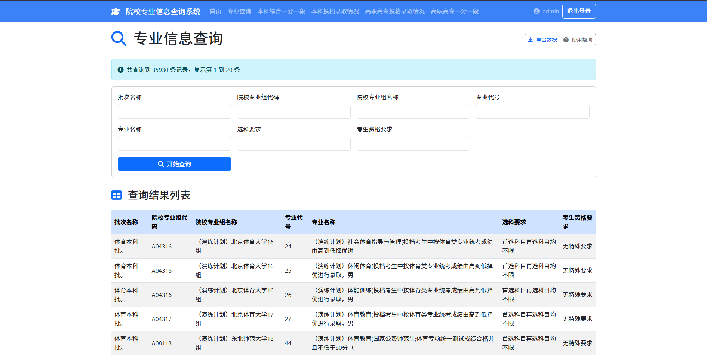
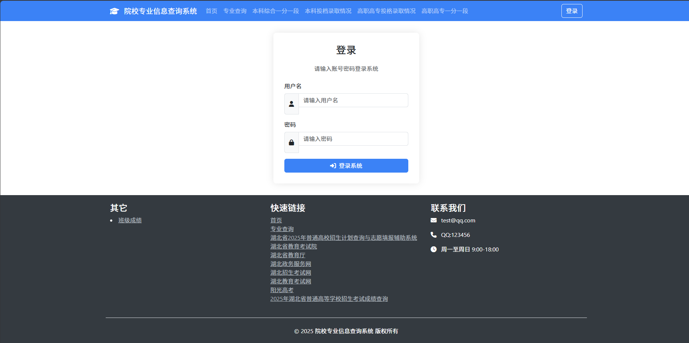

# 查询图谱系统

查询图谱系统是一个基于Python的Web应用，旨在通过知识图谱技术帮助用户查询和可视化复杂的关联信息。

## 功能特点

- 知识图谱可视化查询
- 实体关联分析
- 复杂关系挖掘
- 用户友好的界面设计

## 数据库结构

ziyuan.sql文件定义了系统的数据库表结构，主要包含以下表：

### 核心业务表
- **universities**：学校信息表
  - 用途：存储学校基本信息
  - 主要字段：id (主键), name (学校名称)

- **major_infos**：专业信息表
  - 用途：存储院校专业组及专业详细信息
  - 主要字段：id (主键), batch_name (批次名称), college_code (院校专业组代码), college_name (院校专业组名称), major_code (专业代号), major_name (专业名称), subject_requirement (选科要求)

### 用户与权限表
- **admins**：系统管理员表
  - 用途：存储管理员账号信息
  - 主要字段：id (主键), admin_name (管理员用户名), admin_password (管理员密码)

### 系统日志表
- **access_logs**：访问日志表
  - 用途：记录系统访问记录
  - 主要字段：id (主键), user_id, ip_address, request_method, endpoint, access_time, response_status等

- **score_table**：成绩表
  - 用途：存储分数信息
  - 主要字段：id (主键), name, theory_score (理论成绩), practical_score (实践成绩), cultural_score (文化成绩), total_score (总成绩)

## 项目展示




## 项目结构

```
志愿查询系统/
├── 1.png               # 展示图1
├── 2.png               # 展示图2
├── app.py              # 应用程序入口
├── ziyuan.sql          # 数据库结构文件
├── index.html          # 单独部署的导航页
├── static/             # 静态资源
│   ├── css/            # 样式表
│   ├── js/             # JavaScript文件
│   └── images/         # 图片资源
└── templates/          # HTML模板
    ├── admin.html      # 管理员页面
    ├── login.html      # 登录页面
    ├── chaxun.html     # 查询页面
    └── ...             # 其他页面模板
```

## 安装与设置

### 前提条件
- Python 3.8+ 
- pip (Python包管理器)

### 安装步骤

1. 克隆或下载项目到本地

2. 进入项目目录
```
cd 志愿查询系统
```

3. 创建并激活虚拟环境
```
python -m venv .venv
# Windows激活虚拟环境
.venv\Scripts\activate
# macOS/Linux激活虚拟环境
source .venv/bin/activate
```

4. 安装依赖

## 运行应用

```
python app.py
```

在浏览器中访问 http://localhost:5000 即可使用系统

## 依赖项

- Flask
- Bootstrap
- jQuery
- ECharts

## 许可证

本项目采用GPL-2.0 license许可证 - 详情参见LICENSE文件

## 贡献

欢迎提交issues和pull requests来帮助改进这个项目。

## 联系方式

- QQ交流群: 1121552990
- 如有任何问题或建议，请联系: 1773114200@qq.com